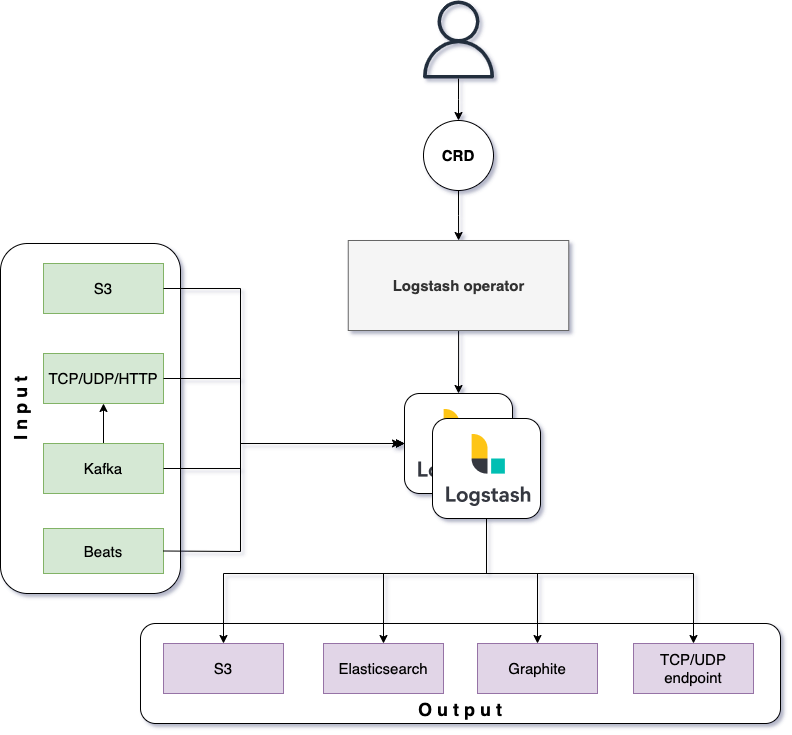
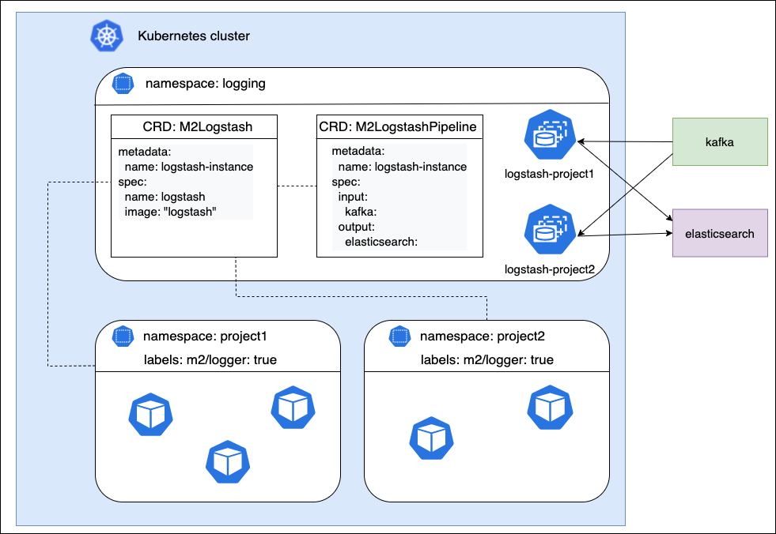

# Logstash operator
Позволяет автоматизировать развертывание инстансов Logstash в Kubernetes кластере, также конфигурировать источники получения данных, фильтрацию и отправку в различные приемники
___
Logstash-operator automates the deployment Logstash instances in Kubernetes cluster and input, filter, output chains configuration

## Work scheme


## Описание работы
Группы инстансов logstash привязываются к namespace. Эта привязка регулируется лейблом `m2/logger: true`

Для конфигурирования Logstash operator используются `Custom Resource Definition`
- m2logstashes - описание параметров для запуска инстаносов Logstash
- m2logstashpipelines - описание цепочек input, filter и output пайплайна Logstash

А также ряд лейблов и аннотаций, которые позволяют вносить коррективы в зависимости от namespace.
Более детальное [описание](docs) и [примеры](docs/examples).
___
## How does it work?
Group of Logstash instances binds to namespace. This binding is configured by label `m2/logger: true`

You can configure the Logging operator using the following Custom Resource Descriptions
- m2logstashes - defines parameters for run Logstash instance
- m2logstashpipelines - defines input, filter, output chains in pipeline configuration

Also there is some namespace labels and annotations that put changes into pipeline configuration depends on namespace
See more [details](docs) and [examples](docs/examples).


## Установка
Требования
1. Kubernetes cluster >= 1.19
2. Cert-manager >= 1.5
3. Helm >= 3.0.0 (в случае варианта установки helm chart)

Есть два варианта установки:
- При помощи kustomize
```
kustomize edit set image controller=m2/logstash-operator:latest
kustomize build config/default | kubectl apply -f -
```
- Как Helm chart
```
helm upgrade --install logstash-operator ./chart
```
___
## Installation
Requirements
1. Kubernetes cluster >= 1.19
2. Cert-manager >= 1.5
3. Helm >= 3.0.0 (for deploy via helm chart)

There are two installation options
- Using kustomize
```
kustomize edit set image controller=m2/logstash-operator:latest
kustomize build config/default | kubectl apply -f -
```
- Using Helm chart
```
helm upgrade --install logstash-operator ./chart
```

## Сборка из исходников
Для сборки образа оператора необходимо выполнить команду
```
make docker-build IMG=logstash-operator:latest
```
___
Build from source
Build docker image
```
make docker-build IMG=logstash-operator:latest
```

## License
Licensed under the Apache License, Version 2.0 (the "License");
you may not use this file except in compliance with the License.
You may obtain a copy of the License at

[http://www.apache.org/licenses/LICENSE-2.0](http://www.apache.org/licenses/LICENSE-2.0)

Unless required by applicable law or agreed to in writing, software
distributed under the License is distributed on an "AS IS" BASIS,
WITHOUT WARRANTIES OR CONDITIONS OF ANY KIND, either express or implied.
See the License for the specific language governing permissions and
limitations under the License.